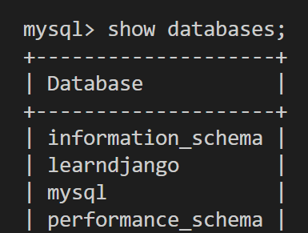

## 7.数据库操作

* MySQL数据库 + pymysql

```python
import pymysql

# 1. 连接MySQL
coon = pymysql.connect(host='127.0.0.1', port=3306, user='root', passwd = 'root123',charset='utf8',db='unicom')
cursor = conn.cursor(cursor=pymysql.cursors.DictCursor)

# 2. 发送指令
cursor.execute("insert into admin(username,passwd,mobile) value('wupeiqi','qwe123','123')")
conn.commit()

#3. 关闭
cursor.close()
conn.close()

```

* Django 开发操作数据库更加简单，内部提供了ORM框架（models.xxx.all()翻译成sql语句）
* ORM 依赖 （pymysql/mysql db/mysqlclient）

### 7.1 安装第三方库

```
pip install mysqlclient
```


### 7.2 ORM

ORM可以帮助我们做两件事

* 创建、修改、删除数据库中的表。（不用写sql语句）【无法创建数据库】
* 操作表中的数据。（不用写sql语句）

#### 1.自己操作数据库

* 启动MySql 服务
* 自带工具创建数据库

```
mysql -u root -p
create database learndjango DEFAULT CHARSET utf8 COLLATE utf8_general_ci;
```



#### 2.Django连接数据库

* 在setting.py文件进行配置进行修改

#### 3.django操作表

* 创建表
* 删除表
* 修改表

创建表，在mysite settings.py下

```python
class UserInfo(models.Model):
    '''
    create table  app01_userinfo(
        id bigint auto_increment primary key,
        name varchar(32),
        password varchar(64),
        age int
    )
    '''
    name = models.CharField(max_length=32)
    password = models.CharField(max_length=64)
    age = models.IntegerField()
```


```
# mysql
use learndjango;
show tables;
```


执行命令：

```
python manage.py makemigrations
python manage.py migarate
```

注意：app要提前注册，否则表不会到数据库

```
desc app01_userinfo;
```

修改表，删除字段，删除表，只要注释然后执行make，migarete就行

但是，如果新增字段，原来表里有数据，就会有选择，让用户增加数据的默认值。1. 手动输入，2. models加上default参数 或者让值可以为空 null=True, blank=True

以后开发如果相对表结构调整，只需要修改models


#### 4.操作表中的数据


### 案例：用户管理

#### 1.展示用户列表

- url
- 函数
  - 获取所有用户信息
  - HTML渲染


#### 2.添加用户

- url
- 函数
  - GET,看到页面，输入内容
  - POST,提交->


#### 3.删除用户

- url
- 函数

```
http://127.0.0.1:8000/info.delete/?nid=1

def 函数(request):
	nid = request.GET.get("nid")
	UserInfo.object.filter(id=nid).delete()
	return HttpResponse("删除成功")
```
