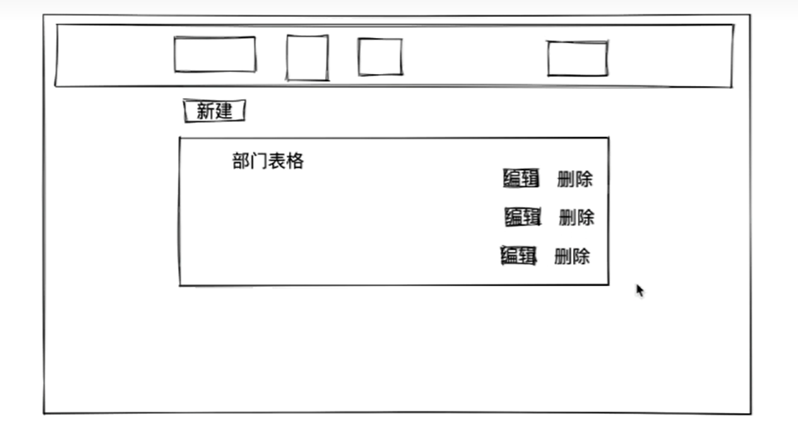

# day2 Django开发

主题：员工管理系统

## 1.新建项目

```
django-admin startproject day2
```

## 2.创建APP

```
python manage.py startapp app01
```

创建完成去setting.py注册app

## 3.设计表结构（django)

创建部门表和员工表

1.员工表存储部门的名称？ID?

    ID、数据库范式(理论知识)，常见开发都是这样。【节省存储开销】

    名称、特别大的公司。查询的次数非常多，查询id需要连表，连表操作比较耗时间。【加速查找、允许数据冗余】

2.部门ID需不需要约束？

    只能是部门表中已存在的id

3.如果部门删除，那关联的用户？

    - 删除用户，级联删除

    - 部门id列置空

## 4.在MySQL中生成表

- 工具连接MySQL生成数据库

```

mysql -u root -p

create database day2 DEFAULT CHARSET utf8 COLLATE utf8_general_ci;
show databases;
```

- 修改配置文件setting.py，连接MySQL
- 基于django命令生成数据表(删除就删除models中的字段，新增要考虑新增的值ps:null|default[手动|自动])

  ```
  python manage.py makemigrations
  python manage.py migrate
  # change mysql
  use day2;
  # 创建表通过app_+class名缩写
  # 查看表结构
  desc app01_department;
  desc app01_userinfo;

  ```
- 表结构创建成功

## 5.静态文件管理

- app目录下创建static，把配置文件存入

  用到的js  https://code.jquery.com/jquery-3.6.0.min.js  应该可以直接复制下来  插件 bootstrap https://v3.bootcss.com/getting-started/#download 可以去这个网站下载
- 创建模板文件

## 6.部门管理

体验，最原始方法来做。

Django中提供Form和ModelForm组件（方便）

### 6.1 部门列表


