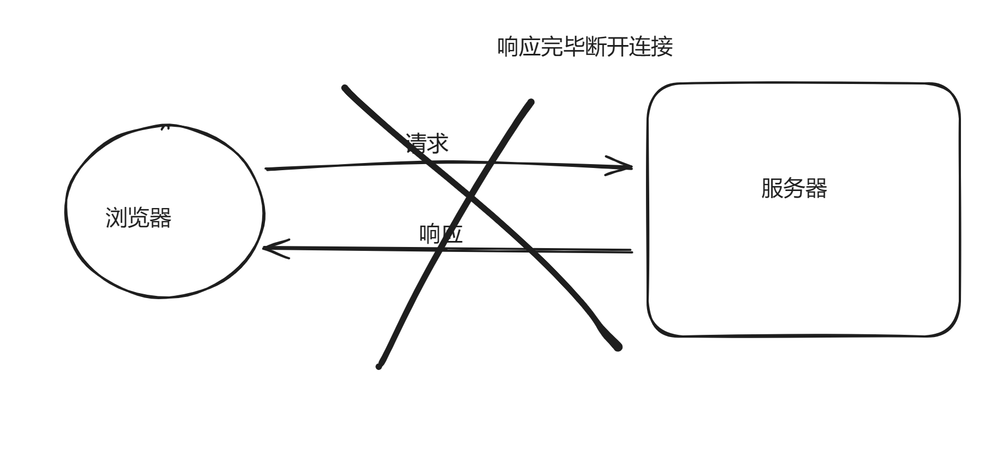
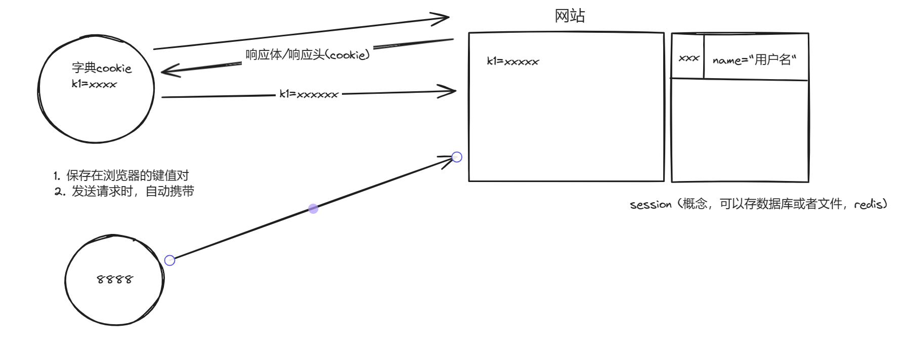

# day4 Django开发

## 12.管理员操作

| id | username | password |
| -- | -------- | -------- |
|    |          |          |
|    |          |          |

```
mysql -u root -p;
show databases;
use day2;
# django创建表格式 app_+字段名小写
desc app01_admin;
insert into app01_admin(username, password) values("xll", "123");
select * from app01_admin;
```


## 13.用户登陆

什么是cookie和session？

- 浏览器网址的通过http请求，无状态的短链接
  

  
